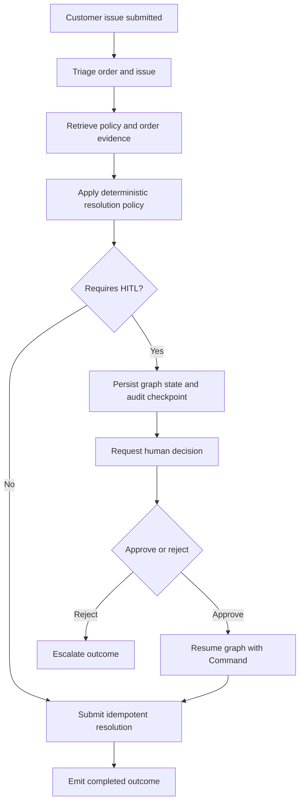
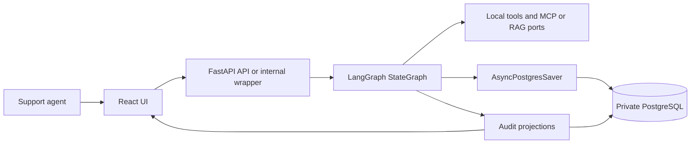
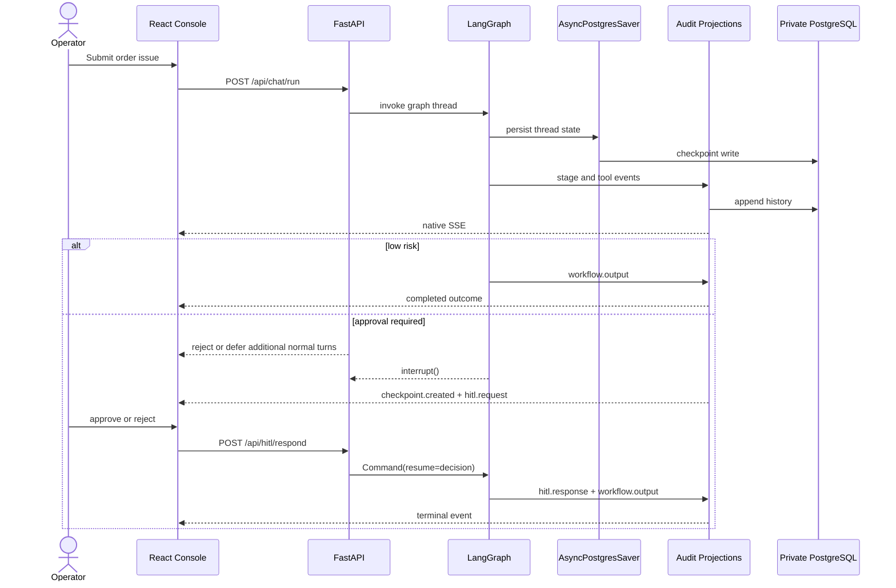
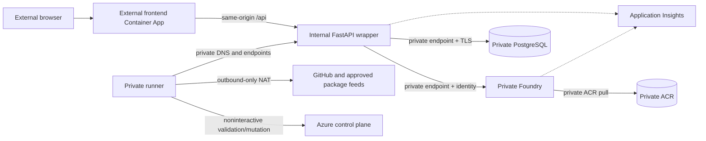

# Architecture: Private Order Resolution Workflow

This document applies the 4+1 view model to the private LangGraph lane:

1. **Logical view**: business stages and responsibility boundaries
2. **Process view**: run sequencing, HITL pause/resume, and durable replay
3. **Development view**: source ownership and contract boundaries
4. **Physical view**: isolated network, hosting, identity, and durability
5. **Scenarios (+1)**: low-risk, HITL, recovery, and redaction outcomes

The lane is a target design and documentation workstream. Repository
configuration does not claim that Azure resources are deployed or healthy.

## Business problem

Support teams need to resolve routine order issues quickly while keeping risky
actions under explicit human control. The system must:

- automate common low-risk cases;
- require a human decision for defined high-risk cases;
- preserve thread history and audit evidence; and
- expose a stable operator timeline without sending credentials or raw
  backend-only data to the browser.

## Project goal

Deliver a verifiable order-resolution workflow that is:

- **single-path**: one shared LangGraph `StateGraph`;
- **decision-safe**: deterministic HITL rules enforced through native
  interrupts;
- **durable**: `AsyncPostgresSaver` for graph state plus separate audit
  projections for browser and operational history;
- **interrupt-safe**: one unresolved interrupt per thread, with new normal
  turns rejected or deferred until approval state is resolved;
- **contract-preserving**: native SSE remains stable while AG-UI and CopilotKit
  stay additive and redacted; and
- **network-isolated**: Foundry, PostgreSQL, ACR, and the runner are private,
  while only the frontend is externally reachable.

## Private network contract

Hosted components use a primary isolated BYO VNet with address space
`10.74.0.0/16` and a dedicated Foundry network-injection VNet with address
space `10.76.0.0/16`. Azure AI Search uses a small `westus3` VNet with address
space `10.75.0.0/24`. Both secondary VNets are globally peered to the primary
VNet.

| Reservation | CIDR | Purpose |
| --- | --- | --- |
| Foundry integration | `10.76.0.0/24` | Private Foundry integration and delegated service traffic |
| Foundry dependency endpoints | `10.76.1.0/24` | ACR, Storage, Cosmos DB, and Search endpoints used by hosted compute |
| Container Apps | `10.74.2.0/23` | External frontend and internal FastAPI wrapper |
| Private endpoints | `10.74.4.0/24` | Foundry, PostgreSQL, and other application-side private endpoints |
| Private runner | `10.74.5.0/27` | Noninteractive Azure validation, packaging, and mutation |
| Search private endpoint | `10.75.0.0/27` | Same-region private endpoint for the `westus3` Search service |

Private DNS zones and VNet links are mandatory. Managed identities and
least-privilege RBAC are required for service-to-service access. A missing
route, DNS link, endpoint approval, identity assignment, or readiness check is
a fail-closed blocker; a public endpoint is not a fallback. The runner subnet
uses an outbound-only NAT Gateway for GitHub, package feeds, Azure control
plane, and extension acquisition. The VM NIC has no public IP and the NSG
permits only required HTTP/HTTPS egress before denying other Internet traffic.
Foundry and both eastus2 VNets remain in `eastus2`; the lane-owned Azure AI Search
dependency is in `westus3` because Microsoft Learn currently marks `eastus2`
unavailable for new Search services. Its private endpoint is in the peered
`westus3` VNet, and the Search private DNS zone is linked to both VNets.

## Logical view

### Logical runtime boundaries

### Business decision model

1. **Triage** identifies the order and issue type.
2. **Policy retrieval** reads order data, local policy, and approved retrieval
   adapters.
3. **Resolution** chooses the action and evaluates the deterministic HITL rule.
4. **Completion or human decision** either submits one idempotent action or
   pauses through `interrupt()` and waits for `Command(resume=...)`.
5. **Turn admission** rejects or defers new normal turns when the thread
   already has one unresolved interrupt.

The model may help summarize or explain, but it does not replace deterministic
policy and HITL enforcement.

### Logical boundaries

- The UI can start a run, read history, consume SSE, and submit one decision.
- The application service owns API-facing lifecycle orchestration, not a second
  business workflow.
- LangGraph owns the ordered business graph.
- `AsyncPostgresSaver` owns authoritative graph resume state.
- Every wrapper replica and retained Foundry session owns separate synchronous
  audit and asynchronous checkpoint pools. Hosted pools therefore keep zero
  idle connections, a short idle lifetime, and bounded maxima.
- Audit projections own browser history, approvals, replay, and evidence, but
  must not duplicate authoritative action, order, or amount state.
- Foundry conversation state and PostgreSQL graph state are separate concerns.

## Process view

### Durable HITL pause, decision, and resume

1. The graph pauses only after checkpointable state is durable.
2. Approval preparation emits `checkpoint.created` and `hitl.request` exactly
   once before control returns with the pending interrupt.
3. The operator responds with approve or reject.
4. The same thread resumes through `Command(resume=...)`.
5. Approval emits one completed terminal output.
6. Rejection emits one escalated terminal output.
7. Duplicate responses remain idempotent.
8. Startup and on-demand reconciliation read authoritative graph checkpoint
   state first, then repair the approval UUID projection if it is missing or
   stale.

## Development view

### Core modules and ownership

| Concern | Ownership | Responsibility |
| --- | --- | --- |
| HTTP and SSE | `backend/app/api/v1/*` | Stable chat, HITL, history, health, AG-UI, and CopilotKit endpoints |
| Application and domain | `backend/app/modules/order_resolution/*` | Service seam, ports, projections, and selected-thread redaction |
| LangGraph runtime | `backend/app/langgraph/*` target namespace | State schema, graph assembly, nodes, tools, prompts, and runtime wiring |
| Infrastructure | `backend/app/infrastructure/*` | PostgreSQL, app-lifetime checkpointer pool, MCP/RAG, idempotency, and Foundry clients |
| Foundry host | `backend/foundry/main.py` | Thin Responses 2.0 host around the shared application service |
| Browser UI | `frontend/src/*` | Native timeline, approval UI, and optional selected-thread views |

The existing packaging/path names are implementation details. They do not
authorize a public dependency or create a second workflow runtime.

### Browser and event contracts

The stable native event names remain:

- `workflow.stage`
- `tool.call`
- `checkpoint.created`
- `hitl.request`
- `hitl.response`
- `workflow.output`

Primary endpoints:

| Endpoint | Contract |
| --- | --- |
| `POST /api/chat/run` | Starts the graph run or delegates the hosted request |
| `GET /api/chat/stream/{thread_id}` | Stable native SSE replay and tail |
| `GET /api/chat/stream/{thread_id}/rich` | Additive rich envelope |
| `GET /api/chat/stream/{thread_id}/ag-ui` | Additive selected-thread AG-UI projection |
| `POST /api/hitl/respond` | Resolves one durable checkpoint |
| `GET /api/workflows*` and `GET /api/sessions/{session_id}/messages` | Durable read models |
| `GET /api/copilotkit[/info]`, `POST /api/copilotkit` | Discovery and read-only CopilotKit bridge |

### AG-UI and CopilotKit

AG-UI and CopilotKit remain additive only:

- They read durable history rather than private graph state.
- They never start or mutate workflow execution.
- They expose only allowlisted lifecycle, tool, approval, and generic terminal
  labels.
- They must not expose raw order, policy, retrieval, prompt, checkpoint, or
  credential data.

## Physical view

### Hosted execution boundary

- The browser talks only to the externally reachable frontend.
- The frontend proxies `/api` and SSE requests to the internal wrapper.
- The wrapper uses managed identity for private Foundry requests and private
  PostgreSQL connections.
- Foundry pulls immutable images from private ACR.
- The private runner performs approved packaging, validation, and Azure
  mutation without public administrative ingress.
- Runner AZD state is retained at
  `/var/lib/order-resolution/private-runner.env` with mode `0600`; immutable
  source refreshes merge protected state instead of overwriting generated
  PostgreSQL credentials.
- Application Insights receives required workflow, Foundry, model, and HITL
  telemetry.
- No direct browser-to-Foundry, browser-to-PostgreSQL, or browser-to-ACR path
  exists.

### Durable stores and recovery

PostgreSQL serves two distinct roles:

1. **Graph durability** through `AsyncPostgresSaver`
2. **Audit durability** through workflow runs, events, approvals, transcripts,
   idempotency, and evidence projections

The graph checkpoint is the workflow-state source of truth. The approval UUID
table is an idempotent audit projection keyed for operator actions and replay
control. Projections must not become a second authority for order identity,
resolution amount, or pending action details.

## Observability, traces, and privacy

- Application Insights is the required telemetry backend.
- Workflow, Foundry invocation, model, and HITL spans remain observable.
- Hosted evaluation must wait for configured trace age and use only fresh
  hosted E2E evidence.
- Native checkpoint tables may contain resume-critical PII such as order or
  customer identifiers. Retention must be purpose-limited, access-controlled,
  excluded from browser projections, and handled more restrictively than
  redacted audit summaries.
- LangSmith is not required.

## Scenarios (+1 view)

| Scenario | Decision path | Expected outcome |
| --- | --- | --- |
| `ORD-1001` low-risk late delivery | No HITL | One completed `workflow.output` |
| `ORD-1009` delayed, approved | HITL required | Checkpoint, approval, resumed completion |
| Damaged item, rejected | HITL required | Checkpoint, rejection, escalated output |
| Wrapper reconnect | Durable replay | Native SSE history replays without duplicate work |
| Selected-thread explanation | Read-only projection | Safe labels only; no sensitive payloads |

## Execution surfaces and release behavior

Supported execution surfaces:

1. Local full stack
2. Private hosted Foundry runtime
3. External frontend with an internal wrapper

Routine release remains app-only after private readiness gates pass.
Noninteractive automation runs from the private runner and fails closed on
unexpected targets, destructive plans, missing private DNS, missing endpoint
approval, missing RBAC, readiness failures, or secret-bearing evidence.
Deployment gates never replace business HITL.

## Verification

| Concern | Evidence and command |
| --- | --- |
| Business behavior and HITL | `make test` |
| Deterministic workflow contract cases | `make eval-backend` |
| Browser native SSE and selected-thread safety | `make test-e2e` |
| Hosted evaluation path | `make foundry-private-eval` |
| Private readiness and deployment contract | `make foundry-private-verify` |
| Release-window telemetry/evidence gate | `make foundry-private-telemetry` |
| Consolidated local design gate | `./scripts/skills/design-review-skill.sh` |

These commands are validation instructions only. No live Azure success is
claimed by this document.
