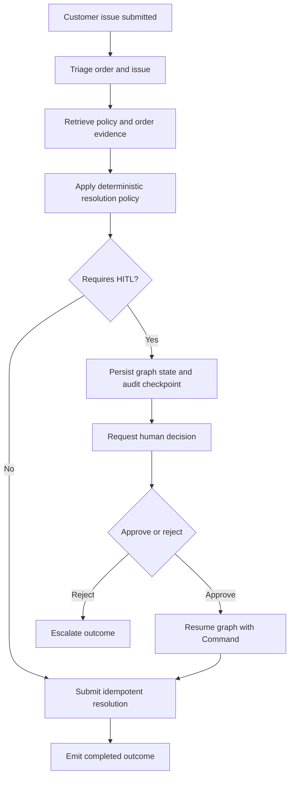
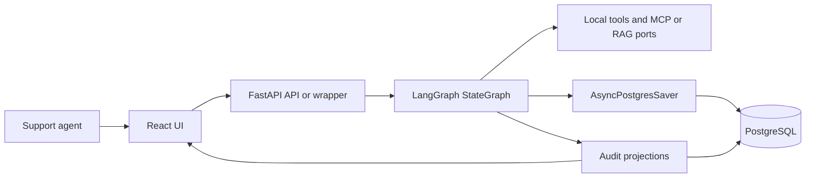
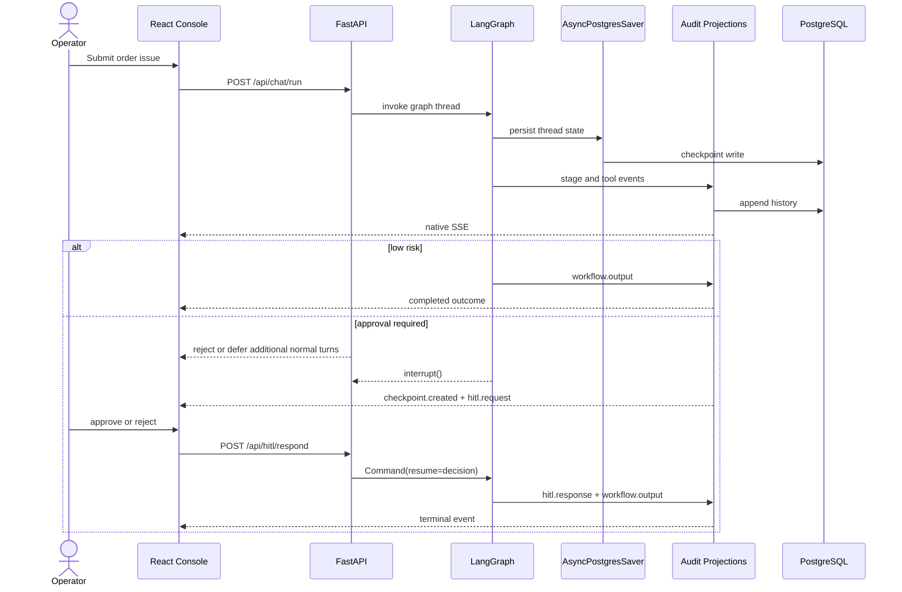
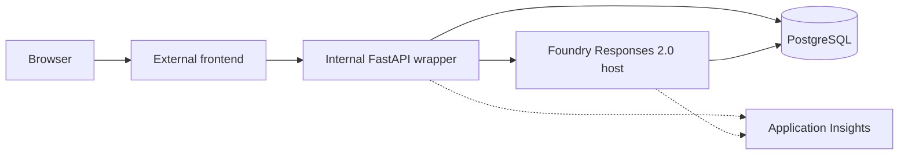

# Architecture: Order Resolution Workflow

## Purpose

This document applies the 4+1 view model to the approved LangGraph migration
target:

1. **Logical view**: business stages and responsibility boundaries
2. **Process view**: run sequencing, HITL pause or resume, and hosted replay
3. **Development view**: source ownership and contract boundaries
4. **Physical view**: hosting, identity, durability, and privacy boundaries
5. **Scenarios (+1)**: low-risk, HITL, recovery, and redaction outcomes

Historical MAF documents are migration provenance only. They are not the
authoritative architecture for this lane.

## Business problem

Support teams need to resolve routine order issues quickly while keeping risky
actions under explicit human control. The system must:

- automate common low-risk cases,
- require a human decision for defined high-risk cases,
- preserve thread history and audit evidence, and
- expose a stable operator timeline without sending internal credentials or raw
  backend-only data to the browser.

## Project goal

Deliver a verifiable order-resolution workflow that is:

- **single-path**: one shared LangGraph `StateGraph`
- **decision-safe**: deterministic HITL rules enforced through native
  interrupts
- **durable**: `AsyncPostgresSaver` for graph state plus separate audit
  projections for browser and operational history
- **interrupt-safe**: one unresolved interrupt per thread, with new normal
  turns rejected or deferred until approval state is resolved
- **contract-preserving**: native SSE remains stable while AG-UI and
  CopilotKit stay additive and redacted
- **release-governed**: public deployment claims require fresh smoke, E2E,
  telemetry, and evaluation evidence

## Logical view



### Logical runtime boundaries



### Business decision model

1. **Triage** identifies the order and issue type.
2. **Policy retrieval** reads order data, local policy, and approved retrieval
   adapters.
3. **Resolution** chooses the action and evaluates the deterministic HITL rule.
4. **Completion or human decision** either submits one idempotent action or
   pauses through `interrupt()` and waits for `Command(resume=...)`.
5. **Turn admission** rejects or defers new normal turns when the thread
   already has one unresolved interrupt. The system never allows more than one
   pending interrupt per thread.

The model may help summarize or explain, but it does not replace the
deterministic policy and HITL contract.

### Logical boundaries

- The UI can start a run, read history, consume SSE, and submit one decision.
- The application service owns API-facing lifecycle orchestration, not a second
  business workflow.
- LangGraph owns the ordered business graph.
- `AsyncPostgresSaver` owns authoritative graph resume state.
- Audit projections own browser history, approvals, replay, and evidence, but
  must not duplicate authoritative action, order, or amount state.
- Foundry conversation state and PostgreSQL graph state are separate concerns.

## Process view



### Durable HITL pause, decision, and resume

1. The graph pauses only after checkpointable state is durable.
2. Approval preparation emits `checkpoint.created` and `hitl.request` exactly
   once before control returns with the pending interrupt. Those events are not
   replayed from the resumed interrupt node.
3. The operator responds with approve or reject.
4. The same thread resumes through `Command(resume=...)`.
5. Approval emits one completed terminal output.
6. Rejection emits one escalated terminal output.
7. Duplicate responses remain idempotent.
8. Startup and on-demand reconciliation read authoritative graph checkpoint
   state first, then repair the approval UUID projection if the audit view is
   missing or stale.

### Public hosted request and resume flow

```text
Browser
  -> external frontend Container App
  -> same-origin /api proxy
  -> internal FastAPI wrapper
  -> Foundry Responses 2.0 hosted container
  -> shared PostgreSQL checkpointer and audit projections
```

In the public lane, the browser never receives Foundry credentials. The wrapper
delegates to Foundry and replays durable PostgreSQL history to the browser.
While approval is pending, the wrapper rejects or defers new normal turns for
that thread until the interrupt is resolved.

## Development view

### Core modules and ownership

| Concern | Ownership | Responsibility |
| --- | --- | --- |
| HTTP and SSE | `backend/app/api/v1/*` | Stable chat, HITL, history, health, AG-UI, and CopilotKit endpoints |
| Application and domain | `backend/app/modules/order_resolution/*` | Service seam, ports, projections, and selected-thread redaction |
| LangGraph runtime | `backend/app/langgraph/*` target namespace | State schema, graph assembly, nodes, tools, prompts, and runtime wiring |
| Infrastructure | `backend/app/infrastructure/*` | PostgreSQL, the app-lifetime `AsyncPostgresSaver` pool, MCP or RAG, idempotency, and Foundry clients |
| Foundry host | `backend/foundry/main.py` | Thin Responses 2.0 host around the shared application service |
| Browser UI | `frontend/src/*` | Native timeline, approval UI, and optional selected-thread views |

Legacy MAF-named runtime directories may still exist during migration, but they
are not the target namespace and must not remain as a parallel workflow path.

### Browser and event contracts

The stable native event names remain:

- `workflow.stage`
- `tool.call`
- `checkpoint.created`
- `hitl.request`
- `hitl.response`
- `workflow.output`

Primary endpoints:

| Endpoint | Contract |
| --- | --- |
| `POST /api/chat/run` | Starts the graph run or delegates the hosted request |
| `GET /api/chat/stream/{thread_id}` | Stable native SSE replay and tail |
| `GET /api/chat/stream/{thread_id}/rich` | Additive rich envelope |
| `GET /api/chat/stream/{thread_id}/ag-ui` | Additive selected-thread AG-UI projection |
| `POST /api/hitl/respond` | Resolves one durable checkpoint |
| `GET /api/workflows*` and `GET /api/sessions/{session_id}/messages` | Durable read models |
| `GET /api/copilotkit[/info]`, `POST /api/copilotkit` | Discovery and read-only CopilotKit bridge |

### AG-UI and CopilotKit

AG-UI and CopilotKit remain additive only:

- They read durable history rather than private graph state.
- They never start or mutate workflow execution.
- They expose only allowlisted lifecycle, tool, approval, and generic terminal
  labels.
- They must not expose raw order, policy, retrieval, prompt, checkpoint, or
  credential data.

## Physical view



### Hosted execution boundary

- The browser talks only to the public frontend.
- The frontend proxies `/api` and SSE requests to the internal wrapper.
- The wrapper uses managed identity for Foundry requests.
- The hosted runtime receives PostgreSQL access only through the deterministic
  `CustomKeys` connection placeholder.
- No direct browser-to-Foundry or browser-to-PostgreSQL path exists.

### Durable stores and recovery

PostgreSQL serves two distinct roles:

1. **Graph durability** through `AsyncPostgresSaver`
2. **Audit durability** through workflow runs, events, approvals, transcripts,
   idempotency, and evidence projections

The graph checkpoint is the workflow-state source of truth. The approval UUID
table is an idempotent audit projection keyed for operator actions and replay
control. Projections must not become a second authority for order identity,
resolution amount, or pending action details; if audit rows drift, startup or
on-demand reconciliation must derive repairs from the checkpointed graph state.

This lets the system:

- replay native SSE after reconnect,
- resume HITL without duplicating side effects,
- preserve audit history across process restarts, and
- keep release evidence separate from runtime graph storage.

## Observability, traces, and privacy

- Application Insights is the required telemetry backend.
- Health and SSE request spans are excluded from request telemetry in the
  public lane.
- Workflow, Foundry invocation, model, and HITL spans remain observable.
- Hosted evaluation must wait for configured trace age and use only fresh
  hosted E2E evidence.
- Native checkpoint tables may contain resume-critical PII such as order or
  customer identifiers. Retention must be purpose-limited, access-controlled,
  excluded from browser projections, and handled more restrictively than
  redacted audit summaries.
- LangSmith is not required.

## Scenarios (+1 view)

| Scenario | Decision path | Expected outcome |
| --- | --- | --- |
| `ORD-1001` low-risk late delivery | No HITL | One completed `workflow.output` |
| `ORD-1009` delayed, approved | HITL required | Checkpoint, approval, resumed completion |
| Damaged item, rejected | HITL required | Checkpoint, rejection, escalated output |
| Wrapper reconnect | Durable replay | Native SSE history replays without duplicate work and reconciliation restores the approval projection from graph state if needed |
| Selected-thread explanation | Read-only projection | Safe labels only; no sensitive payloads |

## Execution surfaces and release behavior

Supported execution surfaces:

1. Local full stack
2. Public Foundry hosted agent
3. Public browser wrapper path

Routine release remains app-only. Bootstrap and reuse rules, PostgreSQL
readiness, package-feed policy, immutable digests, source sync, telemetry trace
age, and evidence integrity are defined in
[deployment-flow.md](deployment-flow.md) and
[engineering-operating-model.md](engineering-operating-model.md).

## Verification

| Concern | Evidence and command |
| --- | --- |
| Business behavior and HITL | `make test` |
| Deterministic workflow contract cases | `make eval-backend` |
| Browser native SSE and selected-thread safety | `make test-e2e` |
| Hosted evaluation path | `make eval-foundry` |
| Live deployment contract | `make foundry-verify` |
| Release-window aggregation | `make foundry-evidence` |
| Consolidated local design gate | `./scripts/skills/design-review-skill.sh` |
