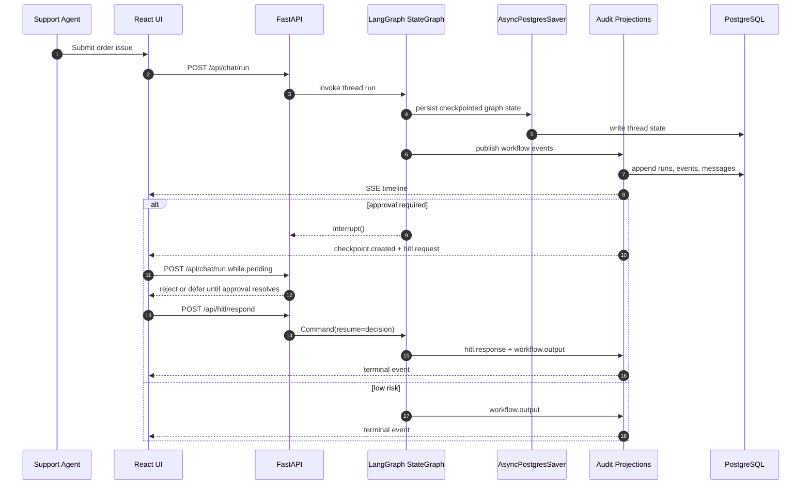

# User Flow

## Execution surfaces

The approved journey has three execution surfaces:

| Surface | Status | Meaning |
| --- | --- | --- |
| Local full stack | Contract baseline | React + FastAPI + LangGraph + PostgreSQL define the stable UI, API, and SSE behavior. |
| Public Foundry-hosted agent | Approved target | Foundry Responses 2.0 hosts the same shared LangGraph business flow. |
| Public browser wrapper | Approved target | External frontend proxies same-origin `/api` traffic to the internal FastAPI wrapper, which delegates to Foundry and replays durable events. |

Historical MAF-era releases are migration provenance only. Fresh LangGraph
smoke, E2E, evaluation, and telemetry evidence must be generated after runtime
cutover.

## Runtime user flow

1. The support agent submits an order issue in the UI.
2. The browser opens the stable SSE timeline for the selected thread.
3. If that thread already has an unresolved interrupt, the backend rejects or
   explicitly defers the new normal turn until the pending approval is
   resolved. Only one pending interrupt is allowed per thread.
4. Otherwise the backend starts one LangGraph `StateGraph` run:
   - triage identifies order and issue type;
   - policy retrieval reads order, policy, MCP, and optional RAG inputs;
   - resolution decides the action and whether HITL is required.
5. Every meaningful step is projected into stable native events and persisted
   for history and replay.
6. If approval is required:
   - the graph pauses through `interrupt()`;
   - the native checkpoint stores authoritative thread state in PostgreSQL;
   - approval preparation emits `checkpoint.created` and `hitl.request`;
   - the approval UUID audit projection records the pending decision without
     becoming the source of truth for action, order, or amount state.
7. The reviewer approves or rejects through the API.
8. The backend resumes with `Command(resume=...)`, emits `hitl.response`, and
   finishes with one terminal `workflow.output`.
9. The UI keeps the thread available for follow-up turns and history review
   only after the interrupt is resolved.

## End-to-end happy path



## Public hosted request and resume flow

The public topology keeps the browser on the same contract:

```text
Browser
  -> external frontend Container App
  -> same-origin /api proxy
  -> internal FastAPI wrapper
  -> Foundry Responses 2.0 hosted container
  -> shared PostgreSQL checkpointer and audit projections
```

For the hosted wrapper path:

1. The wrapper records the dispatch and selects the thread identity.
2. It sends the initial request to Foundry without browser-direct credentials.
3. The hosted container runs the same shared LangGraph business flow.
4. The browser gets live updates from durable PostgreSQL projections through
   polling and native SSE.
5. While approval is pending, the wrapper rejects or defers new normal turns
   for that thread.
6. Approval or rejection resumes the same thread and the same graph state.

## Stable event contract

These native event names remain stable for frontend and test consumers:

- `workflow.stage`
- `tool.call`
- `checkpoint.created`
- `hitl.request`
- `hitl.response`
- `workflow.output`

`tool.call` may include safe metadata such as opaque evidence IDs or retrieval
counts, but it must not expose raw MCP/RAG content, prompts, credentials, or
secrets to browser surfaces.

## Selected-thread projections

- `GET /api/chat/stream/{thread_id}/ag-ui`
- `POST /api/copilotkit`

These are additive, read-only, redacted projections of durable workflow
history. They never start or resume a workflow and expose only allowlisted
lifecycle labels, safe tool labels, opaque checkpoint identifiers, approval
status, and generic terminal text.

The durable projection is an operator view, not the authoritative workflow
state store. It must not duplicate authoritative action, order, or amount state
already owned by the native checkpoint.

## Pagination contracts

- Workflow history: `GET /api/workflows?page=<n>&page_size=<n>`
- Workflow events: `GET /api/workflows/{thread_id}/events?limit=<n>&cursor=<token>`
- Session transcript: `GET /api/sessions/{session_id}/messages?limit=<n>&cursor=<id>`

## HITL reference

See [hitl-approval-conditions.md](hitl-approval-conditions.md) for the exact
approval triggers and test matrix.
