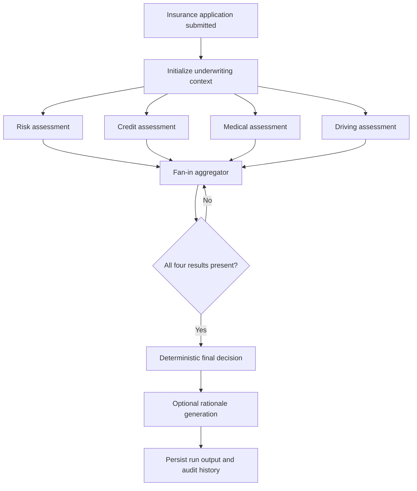
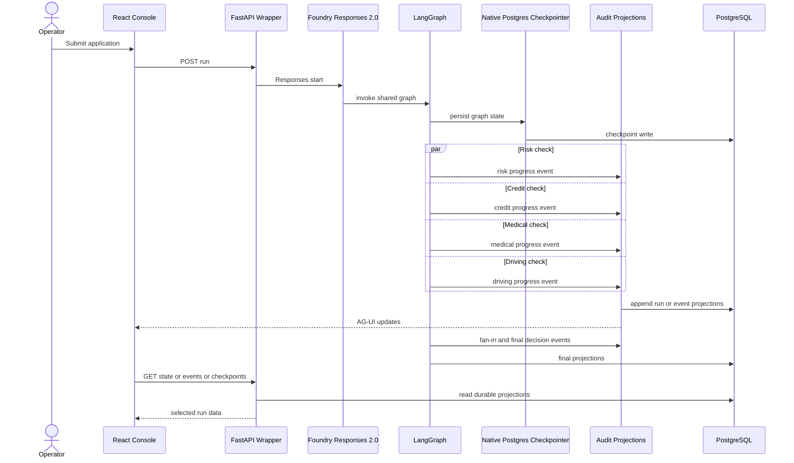
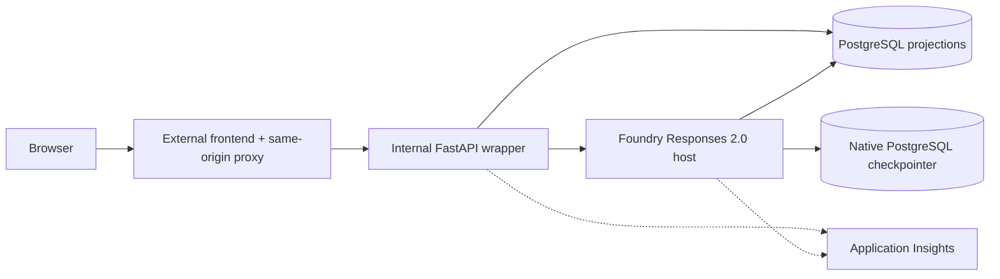

# Architecture: Underwriting Workflow

## Purpose

This document applies the 4+1 view model to the approved underwriting LangGraph migration target:

1. **Logical view**: business stages and responsibility boundaries
2. **Process view**: run sequencing, retry, crash, and resume behavior
3. **Development view**: source ownership and contract boundaries
4. **Physical view**: hosting, privacy, durability, and telemetry boundaries
5. **Scenarios (+1)**: happy, retry, crash, resume, fan-in, and selected-run privacy outcomes

Historical MAF documents are migration provenance only. They are not the architectural authority for this lane.

## Business problem

Underwriting teams need to process insurance applications quickly while keeping decisions deterministic, durable, explainable, and safe under retries or crashes. The system must:

- automate low-risk applications,
- surface risky applications with transparent score factors,
- preserve complete run history and state transitions,
- recover from crashes without duplicating side effects, and
- expose a stable operator console without leaking backend-only data to the browser.

## Project goal

Deliver a verifiable underwriting workflow that is:

- **single-path**: one shared LangGraph `StateGraph`
- **decision-safe**: deterministic underwriting policy before rationale generation
- **durable**: native PostgreSQL checkpointing plus separate audit projections
- **contract-preserving**: stable application form, run history, AG-UI, checkpoint, and CopilotKit behavior
- **privacy-preserving**: same-origin proxy plus strict selected-run allowlist
- **release-governed**: public deployment claims require fresh smoke, E2E, telemetry, and evaluation evidence

## Logical view

### Business decision model

1. Intake creates one underwriting context for a single `workflow_run_id`.
2. Risk, credit, medical, and driving assessments run independently and may complete in any order.
3. Fan-in aggregation proceeds incrementally, but no terminal decision is made until all four check results are present.
4. Deterministic policy computes the approval, conditional approval, referral, or decline outcome.
5. Model-generated rationale may explain the result but cannot alter the deterministic decision.
6. Resume reloads checkpointed graph state and continues remaining work without duplicating completed side effects.

### Logical boundaries

- The UI may start a run, select history, inspect events and checkpoints, and resume a crashed run.
- The internal backend wrapper owns browser-facing lifecycle orchestration, not a second business workflow.
- LangGraph owns ordered business execution.
- Native PostgreSQL checkpointer state is authoritative for workflow resume.
- Audit projections own browser history, checkpoint summaries, replay, results, and release evidence, but must not duplicate authoritative workflow state.
- CopilotKit and AG-UI are read-only selected-run projections.

## Process view

### Crash and resume

1. The operator can trigger a crash scenario after a named executor such as `medical_check`.
2. The latest graph checkpoint remains durable in PostgreSQL.
3. Resume uses the same `workflow_run_id` and restores checkpointed graph state.
4. Remaining checks and final decision continue without rerunning completed writes.
5. Idempotency guards surface explicit `idempotency_skip` evidence when replay would otherwise duplicate a side effect.

### Browser contracts that must stay stable

- Application entry form and scenario picker
- Run history selection and refresh
- Durable `runs`, `state`, `events`, and `checkpoints` APIs
- AG-UI stream updates consumed by the timeline
- Checkpoint timeline and resume affordance
- Four-check fan-in display
- Selected-run CopilotKit explanation using only safe metadata

## Development view

### Core modules and ownership

| Concern | Ownership | Responsibility |
| --- | --- | --- |
| HTTP, AG-UI, CopilotKit | `backend/app/api/v1/*` | Stable run, resume, history, health, AG-UI, and CopilotKit endpoints |
| Application and domain | `backend/app/modules/underwriting/*` | Service seam, deterministic underwriting policy, projections, safe selected-run context |
| LangGraph runtime | `backend/app/langgraph/*` target namespace | State schema, graph assembly, nodes, retry wiring, and checkpoint integration |
| Infrastructure | `backend/app/infrastructure/*` | PostgreSQL, idempotency, telemetry, and Foundry wrapper clients |
| Foundry host | `backend/foundry/main.py` | Thin Responses 2.0 host around the shared underwriting application service |
| Browser UI | `frontend/src/*` | Form, run history, timeline, recovery, and selected-run assistant |

Legacy MAF-named runtime directories may still exist during migration, but they are not the target namespace and must not remain as a parallel workflow path.

### Event and privacy contracts

- Durable event types consumed by the UI remain stable: `workflow_start`, `retry_attempt`, `retry_backoff`, `retry_exhausted`, `check_completed`, `fan_in_result_received`, `final_decision`, `workflow_completed`, `workflow_crashed`, `resume_requested`, `resume_completed`, and `idempotency_skip`.
- AG-UI remains additive. The frontend stream consumes the `CUSTOM` / `underwriting.event` envelope and merges it with durable reads.
- CopilotKit remains additive and allowlisted. It may expose only run id, normalized status, safe event metadata, checkpoint summary, and categorical final decision.

## Physical view

### Hosted execution boundary

- The browser talks only to the public frontend origin.
- The frontend proxies `/api` and `/backend-health` to the internal backend.
- The backend starts or resumes hosted work and reads durable projections.
- The hosted runtime resolves runtime secrets through the project `CustomKeys` placeholder only.
- No direct browser-to-Foundry or browser-to-PostgreSQL path exists.

### Durable stores and recovery

PostgreSQL serves two distinct roles:

1. **Graph durability** through native LangGraph checkpointing
2. **Audit durability** through workflow runs, events, checkpoint summaries, underwriting results, idempotency records, and release evidence projections

Checkpoint state is the workflow-state source of truth for crash recovery. Audit projections drive operator views and selected-run summaries but must never become a second authority for underwriting workflow state.
